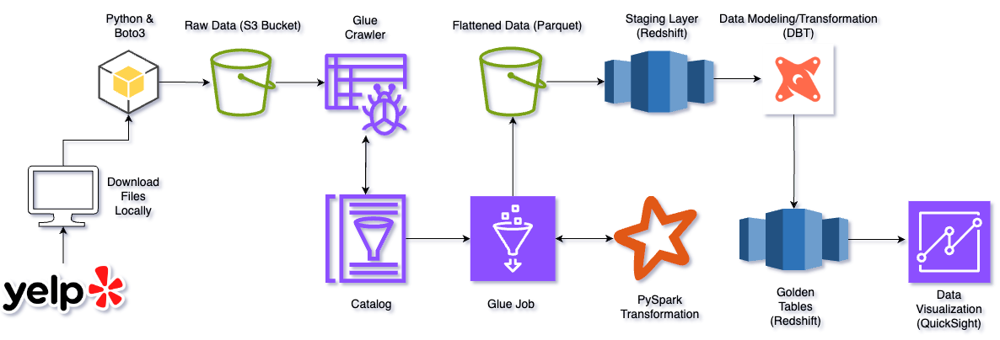
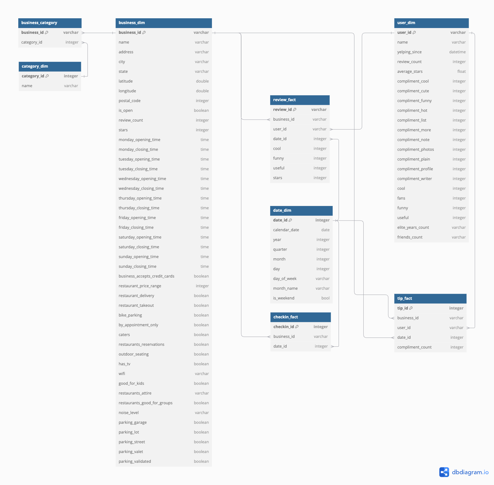
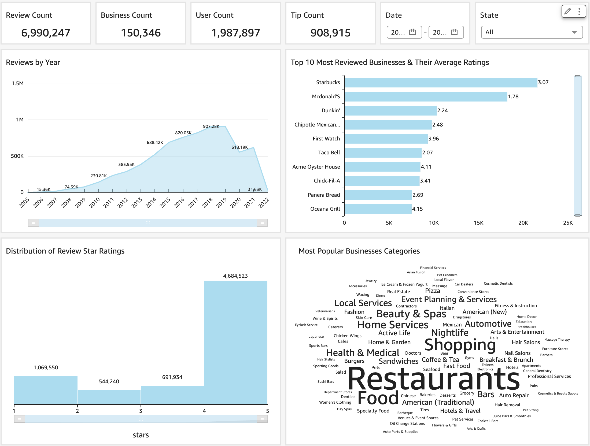

# Yelp Data Pipeline
The Yelp pipeline is desgined to extract data from the publicly avaiable [Yelp dataset](https://www.yelp.com/dataset), load it into an S3 bucket, and perform various transformations with PySpark (e.g., flattening JSON files, etc.). It then utilizes dbt alongside Redshift for additional transformations, data modeling, and testing to ensure data integrity.

## Data Flow Diagram


## Repository Structure
- `src/`: Contains the source code for the project.
  - `src/pipeline/`: Contains Python scripts for AWS Glue job and data loading:
    - `aws_glue_job.py`: Configures and runs the AWS Glue job for data transformation.
    - `extract_and_load_s3.py`: Handles the extraction of data from source and loading into S3.
    - `execute_staging_queries.py`: Script for executing queries to create staging tables from parquet residing in S3 bucket.
  - `src/sql/`: SQL scripts for creating staging (`stg`) tables in Redshift.
    - `stg/`: Scripts for creating staging tables.
  - `src/utils/`: Utility scripts and modules for the project.
    - `connect_redshift.py`: Script to establish connection to Redshift database.
- `yelp_dbt_pipeline/`: Contains DBT configuration and models for handling DBT tasks.
  - `dbt_project.yml`: Main configuration file for DBT project.
  - `models/`: DBT models for data transformation.
    - `gldn/`: Contains scripts for creating analytical (gold) tables in Redshift.
    - `sources.yml`: Contains the configuration for the source tables in the staging layer.
  - `packages.yml`: Defines DBT dependencies.


## Environment Setup
1. Clone the repository:
```
git clone https://github.com/justinpakzad/yelp-etl
```
2. Create a virtual enviornment:
```
pyenv virtualenv 3.10.6 yelp_pipeline
pyenv activate yelp_pipeline
```
3. Install required Python dependencies:
```
pip install -r requirements.txt
```
5. Install required dbt dependencies:
```
dbt deps
```
4. Configure env variables and populate it with AWS credentials:ty
```
touch .env
AWS_ACCESS_KEY_ID=your_access_key
AWS_SECRET_ACCESS_KEY=your_secret_key
BUCKET_NAME=your_s3_bucket_name
REDSHIFT_CLUSTER_IDENTIFIER=your_redshift_cluster_id
```

## Run The Pipeline
1. Begin by downloading the [Yelp dataset](https://www.yelp.com/dataset) and running the `extract_and_load_s3.py` script to extract the data from the tar file and load it into S3:
```
python extract_and_load_s3.py
```
2. Once the data is loaded into S3, proceed by running the `aws_glue_job.py` script located in the src/pipeline/ directory. This script configures and executes the AWS Glue job to transform the data.
3. After the data has been transformed and the parquet files have been loaded into s3, proceed to run the `execute_staging_queries.py` to create the staging tables in Redshift:
```
python execute_staging_queries.py
```
4. Finally, once the staging tables are successfully loaded into Redshift, dbt will handle the creation of the data models and golden tables. It will also run various tests to verify the data's integrity. Execute the following commands to proceed:
```
dbt run
dbt test
```

## Data Model


## Dashboard 
